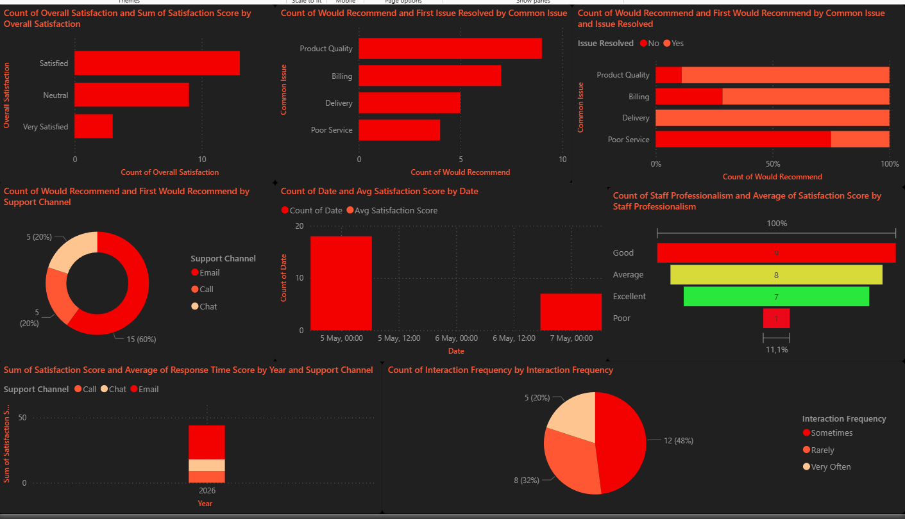
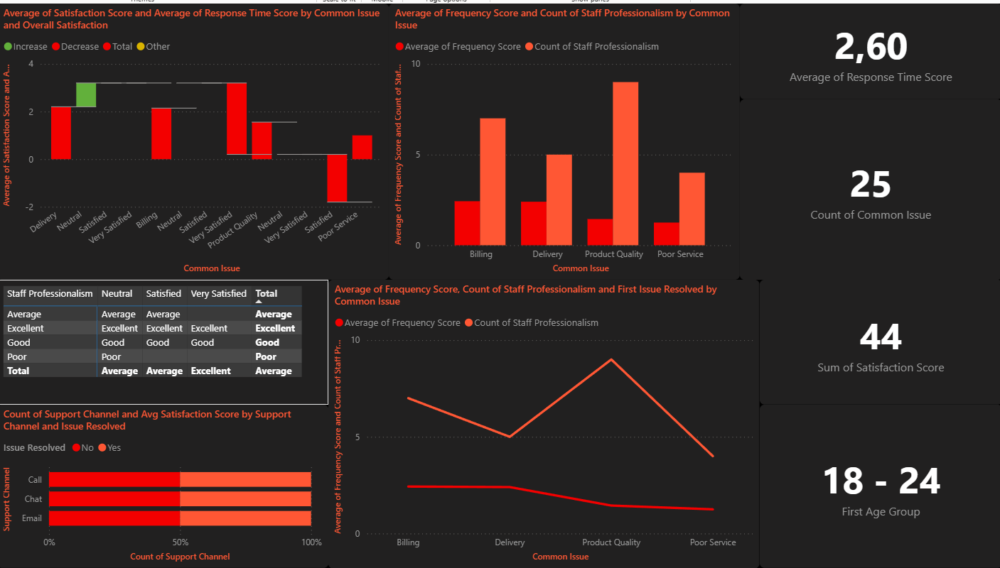

# Customer Service Survey — Data Cleaning, Analysis & Power BI Dashboard

A full end-to-end data project covering raw survey data collection, Python-based data cleaning, Excel output formatting, and a two-page corporate Power BI dashboard. Built as a learning project to demonstrate real-world data handling, DAX measures, and business intelligence reporting.

---

## Table of contents

- [Project overview](#project-overview)
- [Dataset](#dataset)
- [Tools used](#tools-used)
- [Project structure](#project-structure)
- [Data cleaning — Python](#data-cleaning--python)
- [Excel output formatting](#excel-output-formatting)
- [Power BI dashboard — Page 1](#power-bi-dashboard--page-1)
- [Power BI dashboard — Page 2](#power-bi-dashboard--page-2)
- [DAX measures](#dax-measures)
- [Key findings from the data](#key-findings-from-the-data)
- [Recommendations](#recommendations)

---

## Project overview

This project takes a raw Google Forms survey export (CSV) about customer service experiences and transforms it into a fully cleaned, formatted, and visualised business intelligence dashboard. The goal was to answer the question: **what is the state of this organisation's customer service, and where does it need to improve?**

The project was completed in three phases:

1. **Data cleaning and transformation** using Python and pandas
2. **Formatted Excel output** using openpyxl with colour coding, ordinal scoring, and structured layout
3. **Two-page Power BI dashboard** using 20+ different chart types, DAX measures, slicers, and AI-powered visuals

---

## Dashboard preview

### Page 1 — Overview & operational performance


### Page 2 — Deep analysis & AI insights


---

## Dataset

- **Source:** Google Forms survey export
- **File:** `Untitled_form.csv`
- **Rows:** 25 survey responses
- **Collection period:** May 4 – May 7, 2026
- **Respondents:** Predominantly 18–24 age group (24 of 25), with 1 respondent in the 25–34 range

### Raw columns

| Column | Type | Description |
|---|---|---|
| Timestamp | Text | Date and time of response including timezone |
| Age Group | Text | Respondent age bracket |
| How often do you interact with customer service? | Text | Interaction frequency |
| How satisfied are you with customer service overall? | Text | Overall satisfaction level |
| What is the common issue you face? | Text | Type of issue experienced |
| How fast is the response time usually? | Text | Perceived response speed |
| Was your issue resolved? | Text | Yes/No resolution outcome |
| How would you rate staff professionalism? | Text | Staff quality rating |
| Preferred support channel | Text | Email, Chat, or Call preference |
| Would you recommend the service? | Text | Yes/No recommendation |

---

## Tools used

| Tool | Purpose |
|---|---|
| Python 3.12 | Data cleaning and transformation |
| pandas | Data manipulation and analysis |
| openpyxl | Excel file creation and formatting |
| Microsoft Power BI Desktop | Dashboard and visualisation |
| DAX | Calculated measures in Power BI |
| GitHub | Version control and project hosting |

---

## Project structure

```
customer-service-survey/
│
├── data/
│   ├── Untitled_form.csv          # Raw Google Forms export
│   └── survey_cleaned.xlsx        # Cleaned and formatted output
│
├── scripts/
│   └── clean_survey.py            # Full cleaning and formatting script
│
├── dashboard/
│   └── GoogleFormDash.pbix        # Power BI dashboard file
│
└── README.md
```

---

## Data cleaning — Python

The raw CSV had several problems that made it unusable for analysis:

- Column names were full survey questions (very long, impossible to reference in code)
- Timestamp included timezone string making it unparseable as a date
- Text values had inconsistent casing (`"very satisfied"` vs `"Very Satisfied"`)
- Yes/No columns were plain text with no numeric encoding
- Ordinal columns (satisfaction, response time, professionalism) had no numeric equivalent making averages and sorting impossible
- No sort order applied to rows

### What the cleaning script does

**Step 1 — Rename columns**
All 10 columns renamed to short, workable names: `Date`, `Age Group`, `Interaction Frequency`, `Overall Satisfaction`, `Common Issue`, `Response Time`, `Issue Resolved`, `Staff Professionalism`, `Support Channel`, `Would Recommend`.

**Step 2 — Parse timestamp**
Converted the raw timestamp string (`2026/05/04 10:27:37 PM GMT+3`) to a clean `YYYY-MM-DD` date format using `pd.to_datetime()` with `format="mixed"` and `utc=True`.

**Step 3 — Standardise text**
All text columns stripped of whitespace and converted to Title Case using `.str.strip().str.title()` to eliminate case inconsistencies across responses.

**Step 4 — Add ordinal score columns**
Four new numeric columns added by mapping text values to integer scores:

| Column | Mapping |
|---|---|
| Frequency Score | Rarely=1, Sometimes=2, Very Often=3 |
| Satisfaction Score | Neutral=1, Satisfied=2, Very Satisfied=3 |
| Response Time Score | Very Slow=1, Slow=2, Fast=3, Very Fast=4 |
| Professionalism Score | Poor=1, Average=2, Good=3, Excellent=4 |

**Step 5 — Sort data**
Rows sorted by `Date` ascending, then `Satisfaction Score` descending so highest satisfaction responses appear first within each date group.

---

## Excel output formatting

The cleaned dataframe was exported to `.xlsx` using openpyxl with the following formatting applied programmatically:

- **Header row** — dark navy background (`#1F3864`), white bold text, 40px row height, centered alignment, wrapped text
- **Alternating rows** — light grey fill (`#F2F2F2`) on even rows for readability
- **Yes cells** — green fill (`#C6EFCE`) applied to all Yes values in Issue Resolved and Would Recommend
- **No cells** — red fill (`#FFC7CE`) applied to all No values
- **Score columns** — light blue fill (`#E8F0FE`) with bold text to distinguish numeric scores from text columns
- **Column widths** — auto-fitted to content with a maximum of 28 characters per column
- **Frozen header** — row 1 frozen so headers remain visible when scrolling
- **Borders** — thin grey borders (`#CCCCCC`) applied to all cells

---

## Power BI dashboard — Page 1

Page 1 focuses on **overview and operational performance**.

### Slicers
- `Age Group` — dropdown
- `Support Channel` — tile buttons
- `Issue Resolved` — tile buttons
- `Date` — between date range picker

### Visuals

| # | Visual type | X-axis / Category | Y-axis / Values | Legend | Purpose |
|---|---|---|---|---|---|
| 1 | KPI Cards (5) | — | Total responses, Resolution Rate, Recommend Rate, Avg Satisfaction, Avg Professionalism | — | Headline numbers |
| 2 | Clustered bar | Overall Satisfaction | Count of responses | — | Satisfaction distribution |
| 3 | Horizontal bar | Common Issue | Count of responses | — | Most reported issues |
| 4 | Stacked bar | Common Issue | Count of responses | Issue Resolved | Issue resolution by type |
| 5 | Donut | Support Channel | Count of responses | — | Channel preference split |
| 6 | Clustered bar | Support Channel | Avg Satisfaction Score | — | Satisfaction by channel |
| 7 | Scatter | Professionalism Score (avg) | Satisfaction Score (avg) | Common Issue | Professionalism vs satisfaction correlation |
| 8 | Scatter | Response Time Score (avg) | Satisfaction Score (avg) | Support Channel | Response time vs satisfaction correlation |
| 9 | Stacked bar | Age Group | Count of responses | Would Recommend | Recommendation by age |
| 10 | Line & column | Date | Responses (col), Avg Satisfaction (line) | — | Trend over time |
| 11 | Funnel | Staff Professionalism | Count of responses | — | Professionalism pipeline |
| 12 | Pie | Interaction Frequency | Count of responses | — | Engagement frequency split |
| 13 | Waterfall | Common Issue | Avg Satisfaction Score | Overall Satisfaction | Satisfaction impact by issue |
| 14 | Ribbon | Date | Avg Satisfaction Score | Support Channel | Channel satisfaction ranking over time |

---

## Power BI dashboard — Page 2

Page 2 focuses on **deep analysis and AI-powered insights**.

### Slicers
- `Staff Professionalism` — tile buttons
- `Response Time` — dropdown
- `Interaction Frequency` — tile buttons

### Visuals

| # | Visual type | Configuration | Purpose |
|---|---|---|---|
| 1 | KPI Cards (6) | Avg Response Time Score, Avg Frequency Score, Unresolved Count, Dissatisfied Count, Very Satisfied Rate, Resolved Satisfaction | Operational KPIs |
| 2 | Treemap | Category: Common Issue, Details: Overall Satisfaction, Values: Count | Issue volume with satisfaction breakdown |
| 3 | Matrix | Rows: Staff Professionalism, Columns: Overall Satisfaction, Values: Count | Professionalism vs satisfaction cross tab with heatmap |
| 4 | 100% Stacked bar | X: Support Channel, Legend: Issue Resolved | Resolution rate per channel |
| 5 | Clustered column | X: Common Issue, Y: Avg Frequency Score + Avg Professionalism Score | Frequency vs professionalism by issue |
| 6 | Line chart | X: Date, Y: Avg Response Time Score + Avg Frequency Score | Response time and frequency trend |
| 7 | Decomposition tree | Analyze: Resolution Rate, Explain by: Issue, Channel, Professionalism, Response Time | AI drill-down of resolution failures |
| 8 | Stacked area | X: Date, Legend: Interaction Frequency, Y: Count | Engagement frequency trend over time |
| 9 | Smart narrative | Auto-reads all visuals | AI-generated plain English summary |
| 10 | Gauge | Value: Avg Response Time Score, Target: 3 (Fast) | Response time vs target |
| 11 | Key influencers | Analyze: Satisfaction Score, Explain by: all columns | AI ranking of satisfaction drivers |

---

## DAX measures

All measures created under the `Survey Data` table in Power BI:

```dax
Avg Satisfaction Score = AVERAGE('Survey Data'[Satisfaction Score])

Avg Professionalism Score = AVERAGE('Survey Data'[Professionalism Score])

Avg Response Time Score = AVERAGE('Survey Data'[Response Time Score])

Avg Frequency Score = AVERAGE('Survey Data'[Frequency Score])

Resolution Rate = DIVIDE(
    COUNTROWS(FILTER('Survey Data','Survey Data'[Issue Resolved]="Yes")),
    COUNTROWS('Survey Data')
)

Recommend Rate = DIVIDE(
    COUNTROWS(FILTER('Survey Data','Survey Data'[Would Recommend]="Yes")),
    COUNTROWS('Survey Data')
)

Unresolved Count = COUNTROWS(
    FILTER('Survey Data','Survey Data'[Issue Resolved]="No")
)

Dissatisfied Count = COUNTROWS(
    FILTER('Survey Data','Survey Data'[Overall Satisfaction]="Neutral")
)

Very Satisfied Rate = DIVIDE(
    COUNTROWS(FILTER('Survey Data','Survey Data'[Overall Satisfaction]="Very Satisfied")),
    COUNTROWS('Survey Data')
)

Resolved Satisfaction = CALCULATE(
    AVERAGE('Survey Data'[Satisfaction Score]),
    'Survey Data'[Issue Resolved]="Yes"
)
```

---

## Key findings from the data

- **Product Quality is the most reported issue** — 9 out of 25 responses (36%) cited it as their main problem, making it the single biggest pain point in the service
- **Over a third of customers are dissatisfied** — 9 of 25 respondents (36%) rated overall satisfaction as Neutral, meaning they are at risk of churning
- **Resolution rate is below industry standard** — 76% of issues resolved (19/25) against an 80% industry benchmark, with 6 issues left unresolved
- **Email dominates channel preference** — 15 of 25 respondents (60%) prefer Email, making it by far the primary support channel, while Chat and Call split the remaining 40% equally
- **Almost all respondents are from the 18–24 age group** — 24 of 25 (96%) fall in this bracket, meaning the dataset almost entirely reflects young adult customer behaviour
- **Only 4 respondents were Very Satisfied** — representing just 16% of responses, showing that while most customers are not actively unhappy, very few are genuinely delighted
- **Poor Service issues have a 0% resolution rate** — all 4 Poor Service responses were marked unresolved, making it the most critical failure area
- **Staff professionalism is mostly Average or Good** — 68% of respondents rated professionalism at Average or Good, with only 7 (28%) rating Excellent and 1 (4%) rating Poor
- **Response time is relatively strong** — 13 of 25 (52%) experienced Fast response and 2 experienced Very Fast, but 10 respondents (40%) still experienced Slow or Very Slow service
- **Recommendation rate is strong at 88%** — 22 of 25 respondents would recommend the service, suggesting overall brand perception is positive despite satisfaction gaps
- **Customers who interact Very Often are more satisfied** — the 5 Very Often respondents skewed toward Satisfied and Very Satisfied, suggesting loyal customers have better experiences
- **Billing issues are resolved at a higher rate than other issues** — most Billing responses were marked resolved with Good to Excellent professionalism, indicating stronger processes in that area
- **Survey responses were heavily concentrated on May 5** — 18 of 25 responses came in on a single day, limiting the reliability of time-based trend analysis

---

## Recommendations

**1. Prioritise Product Quality resolution processes**
Product Quality accounts for 36% of all issues but has inconsistent resolution outcomes. A dedicated product quality escalation path or FAQ system should be implemented to reduce repeat contacts and improve resolution rates for this category.

**2. Fix Poor Service handling immediately**
Every single Poor Service complaint went unresolved. This is a critical failure — a zero resolution rate on any issue category is unacceptable. Staff training or an escalation protocol specifically for service complaints must be introduced as an urgent action.

**3. Set a formal resolution rate target of 85%**
The current 76% rate is below the 80% industry benchmark. An 85% target with monthly tracking would create accountability and drive process improvements across all issue types.

**4. Invest in staff professionalism training**
Only 28% of staff were rated Excellent. Bringing Average-rated staff up to Good through targeted coaching would directly improve satisfaction scores — the scatter plot correlation confirms that higher professionalism scores consistently produce higher satisfaction scores.

**5. Improve slow response time cases**
40% of respondents experienced Slow or Very Slow response times. Introducing response time SLAs (e.g. first response within 2 hours for Email) and tracking them monthly would reduce this and improve the Avg Response Time Score from 2.64 toward the Fast threshold of 3.

**6. Diversify beyond Email support**
60% of customers use Email but satisfaction data suggests Chat and Call may produce better outcomes for certain issue types. Promoting Chat as a faster resolution channel, particularly for Billing and Delivery issues, could improve both response time and satisfaction.

**7. Target the Neutral satisfaction segment**
36% of customers are Neutral — not unhappy enough to complain but not satisfied enough to be retained long term. A follow-up survey or proactive outreach to these customers could convert them to Satisfied before they churn.

**8. Expand the survey to capture more demographics**
96% of respondents are aged 18–24. The dataset does not reflect older customer segments at all. Distributing the survey across wider age groups and over a longer period (minimum 30 days) would produce more statistically reliable insights and enable meaningful demographic comparisons.

**9. Increase survey volume for reliable trend analysis**
25 responses over 3 days is too small a sample for confident trend conclusions. A target of 100+ responses collected weekly would give the Power BI trend charts enough data points to surface meaningful patterns in satisfaction and response time over time.

**10. Reward and replicate Excellent professionalism behaviours**
The 7 staff interactions rated Excellent had noticeably better satisfaction outcomes. Identifying what those staff members do differently and building it into onboarding and training materials would raise the floor on professionalism across the team.
